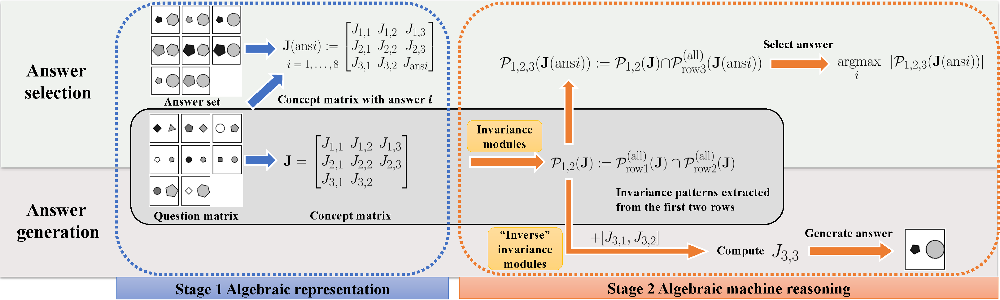
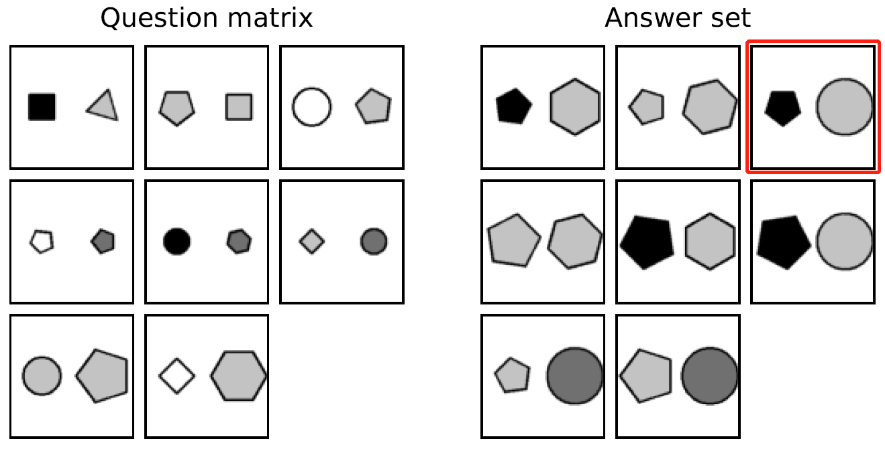

# Abstract Visual Reasoning: An Algebraic Approach for Solving Raven’s Progressive Matrices #

This is the official PyTorch code for the following CVPR 2023 paper:

**Title**: Abstract Visual Reasoning: An Algebraic Approach for Solving Raven’s Progressive Matrices.

**Abstract**: We introduce algebraic machine reasoning, a new reasoning framework that is well-suited for abstract reasoning. Effectively, algebraic machine reasoning reduces the difficult process of novel problem-solving to routine algebraic computation. The fundamental algebraic objects of interest are the ideals of some suitably initialized polynomial ring. We shall explain how solving Raven's Progressive Matrices (RPMs) can be realized as computational problems in algebra, which combine various well-known algebraic subroutines that include: Computing the Gröbner basis of an ideal, checking for ideal containment, etc. Crucially, the additional algebraic structure satisfied by ideals allows for more operations on ideals beyond set-theoretic operations.

Our algebraic machine reasoning framework is not only able to select the correct answer from a given answer set, but also able to generate the correct answer with only the question matrix given. Experiments on the I-RAVEN dataset yield an overall 93.2% accuracy, which significantly outperforms the current state-of-the-art accuracy of 77.0% and exceeds human performance at 84.4% accuracy.

(This code is jointly contributed, in alphabetical order, by Saket Chandra, Zhangsheng Lai, Yufei Wu, and Jingyi Xu. For queries on technical aspects of algebraic machine reasoning, please contact the corresponding author, Kai Fong Ernest Chong.)

## 0. Illustration



## 1. Requirements

- Python 3.8
- PyTorch=1.9.1
- [MMCV](https://github.com/open-mmlab/mmcv)
- [MMDetection](https://github.com/open-mmlab/mmdetection)
- [Macaulay2](http://www2.macaulay2.com/Macaulay2/)

Macaulay2 is a software system designed for research in algebraic geometry and commutative algebra. In this paper, all the computations in the algebraic machine reasoning stage of our reasoning framework is done using Macaulay2. To install Macaulay2 on Ubuntu from official repositories:

```bash
sudo apt install macaulay2
```

Alternatively, the latest version of Macaulay2 can be installed in Ubuntu using PPA (Personal Package Archive).

```bash
sudo add-apt-repository ppa:macaulay2/macaulay2 
sudo apt install macaulay2
```


## 2. Datasets 

To demonstrate the effectiveness of our algebraic machine reasoning framework, we conduct experiments on the RAVEN/IRAVEN datasets. These two datasets use the same generation process for the question matrices of RPM instances. I-RAVEN provides a modified answer generation process that overcomes a flaw in RAVEN's answer generation process: In RAVEN, the correct answer for an RPM instance could potentially be directly inferred via majority voting, even without the question matrix. 

The RAVEN dataset can be downloaded from the official GitHub repository, and the I-RAVEN dataset is generated using the official code, with the same dataset size as RAVEN.




## 3. Perception via Object Detection Models

In order to represent the RPM instances algebraically, we first need to train object detection models to extract the attribute values from the raw RPM images. We use the MMDetection package for the standard training of 4 RetinaNets with ResNet-50 backbones, for the 4 attributes "type", "color", "position" and "size", respectively.

### 3.1 Data processing
The RAVEN/I-RAVEN dataset needs to be processed to a particular format called the middle format specified for MMDetection. For example, to process data to MMDetection middle format for attributes "type", "color", "size", and "position" using .npz files with 60-20-20 split for training, validating and testing, we can use the following command:
```python
python process-data.py --label_attrib types colors abssizes abspositions 
                       --train 60 --val 20 --test 20
```

### 3.2 Training

The configuration files are stored in "./perception/configs/". To train the object detection model on attribute "type", use the following command:

```python
python train-det.py ./configs/perception-types.py
```

For other attributes, change the filename accordingly, to the corresponding configuration file.


## 4. Algebraic Machine Reasoning

To use our algebraic reasoning framework:

```python
python solver.py 
```

The directory structure should be:

```
RPMSolver/
        ├── data
        │   └── prediction_data.txt 
        └── codes
            ├── solver.py
            ├── m2interface.py
            └── modules.m2
```

